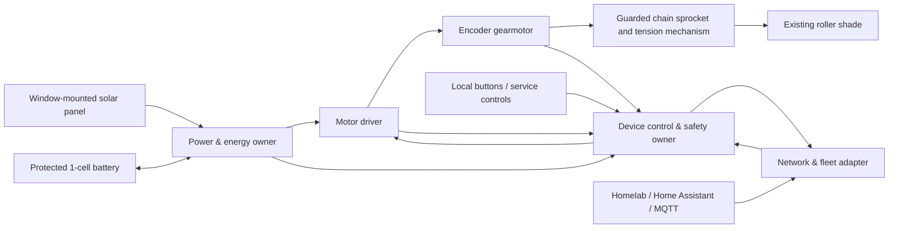

# Solar Shade

> A local-first, solar-assisted retrofit actuator for continuous-loop beaded-chain roller shades.

Solar Shade is an embedded, mechanical, power-electronics, and homelab project intended to turn an existing manual roller shade into a safe, observable, locally controlled device without running permanent power wiring to each window.

The project begins with one real shade and one real window. It will earn generality through measured fixtures, replaceable chain sprockets, bounded power and motion behavior, retained field evidence, and repeated operation—not by assuming that every shade, chain, window, or solar exposure is equivalent.

## Project posture

**Status:** pre-prototype; reference-fixture characterization is the active slice.

Nothing in this repository is a certified consumer product. No unattended installation, child-safe claim, battery-safety claim, winter-energy-neutral claim, or broad compatibility claim has yet been proven.

The immediate goal is narrower:

> Measure one exact shade and window well enough to choose the first sprocket, motor, mount, panel, battery, charger, and safety envelope without guessing.

See [`CURRENT_SLICE.md`](CURRENT_SLICE.md).

## Intended final experience

A successful mature unit should:

- retrofit the existing beaded-chain loop without opening or modifying the shade headrail;
- preserve or replace the chain-tension and guarding function rather than leaving a loose loop;
- open, close, stop, and move to a requested position;
- execute local schedules even when the homelab or network is unavailable;
- accept local-first homelab commands without giving the network direct motor authority;
- harvest enough window light to avoid routine manual charging at a qualified installation;
- retain USB-C service charging and a manual recovery path;
- report position confidence, battery state, harvested energy, motor current, temperature, movement duration, and faults;
- fail with the motor disabled and the chain mechanically safe;
- scale from one proving unit to a maintainable household fleet.

The long-range portfolio result is not merely “an ESP32 turns a blind.” It is an evidence-backed, energy-aware distributed actuator system spanning mechanical characterization, power-path design, embedded safety control, local networking, telemetry, enclosure design, and field validation.

## System shape

The network expresses **desired state**. The embedded control-and-safety owner alone decides whether and how the motor may move.

## Governing reading order

Before changing implementation or selecting hardware, read:

1. [`AGENTS.md`](AGENTS.md)
2. [`CURRENT_SLICE.md`](CURRENT_SLICE.md)
3. [`ARCHITECTURE.md`](ARCHITECTURE.md)
4. the exact dossier or research record relevant to the decision
5. [`PROJECT_STATUS.md`](PROJECT_STATUS.md)

Long-form dossiers preserve intent and pressure. `ARCHITECTURE.md` is the short active system law. `CURRENT_SLICE.md` is the sole live implementation authority.

## Repository map

| Path | Purpose |
|---|---|
| [`AGENTS.md`](AGENTS.md) | Agent and contributor execution rules |
| [`GOVERNANCE.md`](GOVERNANCE.md) | Fact classes, precedence, amendments, evidence, and change law |
| [`UP_TO_SPEED.md`](UP_TO_SPEED.md) | Required technical-lead workflow |
| [`ARCHITECTURE.md`](ARCHITECTURE.md) | Short active architecture and ownership boundaries |
| [`CURRENT_SLICE.md`](CURRENT_SLICE.md) | One bounded authorized slice |
| [`PROJECT_STATUS.md`](PROJECT_STATUS.md) | Current facts, hypotheses, gaps, and next proof |
| [`docs/dossiers/`](docs/dossiers/) | Long-form governing product and system intent |
| [`docs/research/`](docs/research/) | Calculations, supplier research, source records, and worksheets |
| [`docs/contracts/`](docs/contracts/) | Draft external contracts that are not yet implementation authority |
| [`docs/decisions/`](docs/decisions/) | Durable architecture-decision records |
| [`evidence/`](evidence/) | Sanitized retained measurements, logs, images, and trial results |

The full register is in [`DOCUMENT_REGISTER.md`](DOCUMENT_REGISTER.md) and [`DOCUMENT_REGISTER.json`](DOCUMENT_REGISTER.json).

## Foundational dossiers

- [Project at a Glance](docs/dossiers/PROJECT_AT_A_GLANCE.md)
- [System Governing Design](docs/dossiers/SYSTEM_GOVERNING_DESIGN.md)
- [Verification, Field Trial, and Portfolio Governing Design](docs/dossiers/VERIFICATION_FIELD_TRIAL_AND_PORTFOLIO_GOVERNING_DESIGN.md)
- [Pre-mortem, Risk, and Unknown Register](docs/dossiers/PREMORTEM_RISK_AND_UNKNOWN_REGISTER.md)

## Research basis

- [Feasibility and Sizing Model](docs/research/FEASIBILITY_AND_SIZING_MODEL.md)
- [Component Candidates](docs/research/COMPONENT_CANDIDATES.md)
- [Source Register](docs/research/SOURCE_REGISTER.md)
- [Reference-Shade Measurement Worksheet](docs/research/REFERENCE_SHADE_MEASUREMENT_WORKSHEET.md)

Published component specifications and retail prices are snapshots, not purchase guarantees. Real fixture measurements outrank planning estimates.

## Safety boundary

Continuous-loop shade chains can create a strangulation hazard. A motor retrofit must not remove the existing anchored tension function and leave a free loop. The eventual mechanism must guard chain and sprocket pinch points, stop on abnormal current or motion, prevent indefinite motor energization, and provide a safe service state.

Lithium batteries near windows introduce heat and charging hazards. The battery must be protected, temperature-observed, shaded from direct sun, separated from hot glass and motor heat, and charged only inside its qualified range.

See the governing safety requirements in [System Governing Design](docs/dossiers/SYSTEM_GOVERNING_DESIGN.md).

## License posture

No software or hardware license has yet been selected. Public visibility does not itself grant reuse rights. Licensing will be an explicit operator decision before reusable implementation assets are published.
