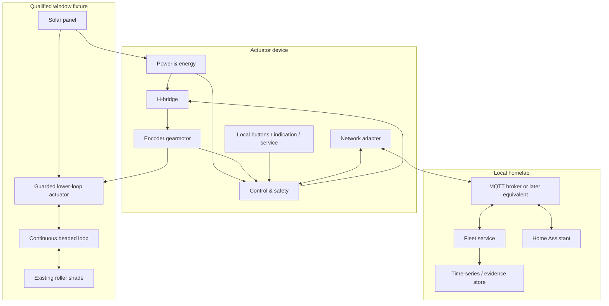

# Solar Shade System Governing Design

## 1. Governing intent

Solar Shade should become a household-quality retrofit system whose apparent simplicity is supported by explicit mechanical, electrical, embedded, network, and verification boundaries.

The desired product is not a remotely controlled motor attached to a cord. It is:

> a reversible, locally autonomous, energy-observable actuator that moves one qualified continuous-loop shade within a measured safety envelope and remains understandable when power, radio, mechanics, or the homelab fail.

The design begins with the maintainer's own shade, but that fixture is a proving ground rather than the definition of all compatible shades.

## 2. What the project is trying to preserve

Automation should preserve the useful properties of the manual shade:

- it remains a shade first;
- local operation remains available;
- the chain remains constrained;
- the shade is not internally modified;
- failure does not require replacing the window covering;
- service does not require a proprietary cloud;
- the homeowner can understand whether the problem is power, chain, motor, calibration, or network.

The project should add:

- schedules;
- position requests;
- solar-assisted autonomy;
- energy and fault telemetry;
- fleet control;
- repeatable installation;
- evidence-backed maintenance.

## 3. Explicit nonclaims

The governing design does not claim:

- compatibility with every beaded chain;
- compatibility with every roller shade clutch;
- a child-safe consumer product;
- compliance with a particular certification regime;
- indefinite operation from one panel at every window;
- that a 2 W-class panel will succeed in winter;
- that one battery chemistry is final;
- that Wi-Fi is the final fleet radio;
- that a single encoder alone guarantees absolute position;
- that a 3D-printed enclosure is production-safe;
- that component retail prices are stable;
- that the first development motor belongs in the final form.

## 4. Reference system context



The product remains useful when the entire `Home` subgraph is absent.

## 5. Product experience

### 5.1 Before purchase or fabrication

A compatibility process should answer:

- What is the bead diameter and pitch?
- Can the connector pass through the drive path?
- What pull force and travel does the shade require?
- Is there an anchored lower mounting location?
- Is there enough guarded enclosure volume?
- Does the window provide useful panel exposure?
- Does the installation have unacceptable heat, moisture, child-access, or mounting constraints?

A later compatibility gauge or printable fit tool should make chain identification easier, but it must be calibrated against actual dimensions.

### 5.2 Installation

The intended actuator occupies the lower-loop region and performs the tensioner's function.

A mature installation should:

1. remove or open the existing lower tensioner only while the loop is controlled;
2. attach the actuator base to a qualified load path;
3. insert the correct sprocket cassette;
4. route the chain around the sprocket and idlers;
5. establish the specified tension;
6. close a captive guard before motor enable;
7. mount the panel separately from the battery heat path;
8. power the unit;
9. enter commissioning;
10. verify local stop;
11. calibrate endpoints slowly;
12. confirm direction, travel, current, and position;
13. name the device locally;
14. complete a guarded installation checklist.

The unit should not rely on the user holding chain tension during ordinary installation steps.

### 5.3 Commissioning

Commissioning is a device-local safety procedure, not merely an app pairing sequence.

It should establish:

- correct motor direction;
- encoder direction;
- safe current limit;
- travel count;
- endpoint behavior;
- movement timeout;
- position confidence;
- panel/battery readings;
- local controls;
- network identity after local operation is proven.

A mature UI may guide the process, but the device must remain able to stop itself if the UI disappears.

### 5.4 Daily behavior

A normal command should result in one of:

- accepted and moving;
- already at desired state;
- accepted but deferred for energy or schedule reason;
- rejected because uncommissioned;
- rejected because faulted;
- rejected because position is uncertain;
- rejected because command is stale;
- rejected because temperature or voltage is unsafe.

“Nothing happened” is not an acceptable state model. The device should expose a reason.

### 5.5 Manual and service behavior

The product should have:

- an immediate local stop;
- local open/close or jog behavior;
- a service or guard interlock;
- a manual release or chain access procedure;
- a USB-C service-power path;
- a documented recalibration path;
- a way to replace wear components;
- a safe behavior when the battery is empty.

Manual chain movement may invalidate position. That is acceptable if the device reports uncertainty and recovers safely.

## 6. Mechanical and shade-interface design

### 6.1 Retrofit boundary

The preferred retrofit acts on the existing chain below the headrail.

Benefits:

- no opening of the shade mechanism;
- reversibility;
- compatibility work is localized to chain and load;
- serviceability;
- visible mechanism for inspection;
- one actuator can potentially support several shades with compatible cassettes.

This boundary is rejected for a fixture if the required tension, force, mount, connector passage, or safety guard cannot be achieved.

### 6.2 Sprocket

The sprocket is fixture-derived.

Inputs include:

- bead diameter;
- bead pitch;
- chain link or cord construction;
- connector geometry;
- desired number of engaged beads;
- required wrap angle;
- target shaft diameter;
- manufacturing tolerance;
- wear and material creep;
- expected temperature.

The idealized pitch radius is:

\[
r = \frac{p}{2\sin(\pi/N)}
\]

This is a starting geometry, not complete tooth design. Pocket diameter, entry relief, groove depth, bead-cord clearance, connector passage, and print shrinkage still require fit testing.

The project should prefer:

- a replaceable cassette;
- visible size marking;
- captive installation;
- a fit coupon before a full mechanism;
- parametric source files;
- a connector-compatible path or explicit connector exclusion.

### 6.3 Chain engagement and tension

A low sprocket wrap can skip under transient load even when the motor torque is adequate.

The mechanism should target:

- enough wrap to engage several beads;
- spring or adjustable tension that does not overload the shade clutch;
- controlled entry and exit;
- idlers that do not damage the cord between beads;
- alignment that avoids edge rub;
- a guard that retains the chain if tension is momentarily lost.

Tension is a measured setting, not “as tight as possible.”

### 6.4 Mount

The mount must resist:

- chain pull;
- motor reaction torque;
- repeated cyclic load;
- accidental handling;
- vibration;
- window heat;
- long-term creep.

Structural fasteners into a known substrate are preferred. Adhesive may assist positioning or distribute load but should not be the only safety-critical retention method unless an exact adhesive/substrate/temperature test qualifies it.

A mount must not:

- interfere with window operation;
- damage insulated-glass seals;
- rely on unknown thin trim strength;
- create a sharp snag point;
- make the chain loop larger;
- put the battery against hot glass.

### 6.5 Motor and gearbox

The first motor should remove uncertainty, not optimize appearance.

A brushed DC encoder gearmotor is the leading first-proof form because it:

- consumes energy only while moving;
- can be PWM soft-started;
- supports bidirectional drive;
- offers current as a useful load signal;
- gives relative motion evidence;
- can be selected in broad gear ratios.

The first motor is selected from:

- measured peak force;
- sprocket pitch radius;
- desired speed;
- design margin;
- current limit;
- shaft and mounting geometry;
- expected duty cycle;
- noise.

Do not treat extrapolated stall torque as a normal rating.

The project should prefer operation where representative running current and temperature remain comfortably below stall behavior. The exact margin is proven through testing rather than fixed by prose alone.

### 6.6 Endpoint and travel strategy

Possible evidence sources include:

- calibrated encoder count;
- current rise near a known clutch limit;
- velocity change;
- physical limit sensors;
- absolute sensing;
- motor-current signature.

The first route may use slow calibration against carefully supervised endpoints, but normal movement should stop from expected travel before a damaging stall.

A later absolute or redundant reference may be justified if manual movement and chain slip make encoder-only position too fragile.

### 6.7 Manual release

The actuator should not trap the user in a dead-battery state.

Candidate strategies:

- disengaging idler;
- opening a guarded cassette;
- sliding motor mount;
- clutch coupling;
- accessible chain bypass.

Release must not create an unattended loose loop. Service state should be clear and motor-disabled.

### 6.8 Noise

Noise is a product variable, not only a motor spec.

Sources include:

- gear mesh;
- PWM frequency;
- enclosure resonance;
- chain/sprocket impact;
- idler friction;
- mount vibration;
- shade clutch.

The design should measure:

- movement duration;
- approximate sound level at a stated distance;
- subjective tonal behavior;
- slow versus fast mode;
- nighttime acceptability.

A faster motor may be noisier and harsher. A slower movement may be more acceptable and energy-efficient, but only measurement decides.

## 7. Power, solar, and battery design

### 7.1 Energy versus power

The motor requires relatively high instantaneous power for a short time. The panel provides variable lower power for hours.

The battery is therefore both:

- an energy reservoir through dark periods;
- a burst-power reservoir during movement.

The power-path controller should allow input power to support the system while the battery supplies any deficit.

The design goal is not “the battery never does work.” It is:

- reduce unnecessary battery current when input exists;
- replenish movement and standby energy;
- avoid damaging charge/discharge overlap;
- preserve safe rail behavior through transients.

### 7.2 Prototype power path

A BQ24074-class board is a reasonable early prototype because it provides:

- one-cell charging;
- system/load output;
- input-current management;
- battery supplement;
- temperature-monitor input;
- service-input convenience.

Its linear topology sacrifices some input voltage as heat and may not recover all panel nameplate power. That is acceptable for characterization if measured.

### 7.3 Custom power path

A BQ25620-class switch-mode part is a later candidate because it offers:

- higher-efficiency conversion;
- NVDC power path;
- battery supplement behavior;
- programmable input regulation;
- current and voltage telemetry;
- protection and thermal features.

A custom charger is not justified until the panel, load, battery, and weak-light route are understood.

### 7.4 Panel

The initial conservative candidate is a nominal 6 V-class, roughly 2.37 W panel.

The panel is selected from:

- loaded output at the exact window;
- glazing and angle losses;
- shade and foliage obstruction;
- winter collection;
- form factor;
- wire route;
- visual acceptance;
- temperature;
- price and availability.

Panel current may serve as a local irradiance proxy, but it is not automatically calibrated illuminance.

### 7.5 Battery

A protected 1S lithium pack around 2,500 mAh is a useful planning size because it provides:

- weeks of estimated reserve at a low daily energy budget;
- adequate motor-burst capability if the exact pack is rated accordingly;
- common charging architecture;
- manageable enclosure size.

The exact pack must publish or be qualified for:

- continuous and pulse discharge;
- protection thresholds;
- charge rate;
- charge temperature;
- discharge temperature;
- dimensions and swelling allowance;
- cycle and storage behavior;
- connector and wire current;
- transport and sourcing.

Capacity alone is not selection.

A LiFePO₄ alternative may offer thermal and longevity advantages but changes voltage, charger, energy density, and motor behavior. It remains a bounded future decision.

### 7.6 Thermal arrangement

The panel may be near glass. The battery should not be.

The physical arrangement should:

- shade the battery;
- separate it from the panel back surface;
- avoid direct contact with glass;
- avoid motor and regulator hot spots;
- provide temperature sensing attached to or representative of the cell;
- stop charging outside the pack's range;
- consider solar heat when the shade is closed.

A white enclosure is not proof of safe cell temperature.

### 7.7 Energy modes

The device should eventually support:

- normal;
- energy-conserving;
- low-energy;
- charge-only;
- thermal inhibit;
- service.

Policy examples:

- refuse nonessential motion below a reserve threshold;
- still allow a safety-relevant local move if adequately powered;
- reduce network wake frequency;
- defer OTA updates;
- publish the reason for deferral;
- avoid deep battery discharge;
- avoid repeated startup brownouts.

Exact thresholds belong to qualified battery and system evidence.

### 7.8 Radio budget

The radio budget must be measured across:

- boot;
- association;
- time synchronization;
- MQTT session;
- telemetry;
- command check;
- deep/light sleep;
- reconnect after outage;
- poor signal;
- OTA.

A design that sleeps at microamps but reconnects frequently at high current may still lose the energy budget.

The device should execute schedules locally to avoid continuous connectivity solely for morning/evening operation.

### 7.9 Motor transient and EMI

The motor path should include:

- driver-local bulk capacitance;
- high-frequency decoupling;
- motor-terminal suppression;
- short current loops;
- controlled ground return;
- driver current limit;
- brownout-safe enable;
- separation of encoder signals from motor noise;
- reset-cause logging.

A large supercapacitor is not the primary solution. The battery and power path own the motor burst; capacitors handle short transients.

## 8. Device control and safety design

### 8.1 State machine

Motion must be explicit.

A command is admitted only after:

- schema/version validation;
- device identity validation;
- freshness and deduplication;
- state validation;
- position-confidence validation;
- power permission;
- thermal permission;
- fault state;
- guard/service state;
- movement bound.

Each transition should be testable without real hardware where possible.

### 8.2 Motor request

The control owner may issue a bounded internal request such as:

```text
direction
target_count_or_position
maximum_duration
maximum_current
ramp_profile
completion_tolerance
command_id
```

The network never supplies raw safety values.

### 8.3 Stop behavior

Stop should:

1. disable commanded drive promptly;
2. choose coast or brake according to measured mechanism safety;
3. retain position and confidence implications;
4. emit completion or fault;
5. prevent stale restart;
6. allow local recovery.

The physical stop input should be sampled and enforced independently of a network loop.

### 8.4 Jam and slip

A robust detector may combine:

- current above a threshold;
- current slope;
- missing encoder counts;
- velocity below expectation;
- motion time;
- position region;
- direction;
- previous movement signature.

One high-current sample should not necessarily declare a jam; one average-current threshold may miss a slipping chain.

The project should retain traces and tune from real events.

### 8.5 Calibration

Calibration stores:

- endpoint counts;
- direction;
- chain/sprocket geometry revision;
- expected current/speed envelopes;
- date and firmware revision;
- confidence state.

Changing sprocket, motor, gearbox, chain tension, or manual release invalidates relevant calibration.

### 8.6 Nonvolatile state

Power loss can occur at any time.

The device should retain enough transactional state to determine:

- whether motion was in progress;
- last durable position;
- whether position is now uncertain;
- active fault;
- calibration revision;
- last accepted command revision;
- schedule revision.

Do not wear flash by writing every encoder count. Use bounded checkpoints and completion records.

### 8.7 Watchdogs and driver default

The hardware should default motor enable off:

- during reset;
- before GPIO initialization;
- during bootloader;
- on watchdog;
- on brownout;
- on firmware crash.

Where practical, driver sleep/enable should have a pull state that disables motion without firmware.

### 8.8 Local schedule

A local schedule should be versioned and small.

It may support:

- time-of-day events;
- weekdays;
- position target;
- enable/disable;
- timezone or absolute UTC strategy;
- missed-event behavior;
- energy deferral.

The device should not replay every missed event after a long outage. It should reconcile to the currently applicable desired state.

## 9. Network, homelab, and fleet design

### 9.1 First transport

Wi-Fi plus MQTT is the expected first transport because it allows:

- transparent messages;
- retained state;
- Home Assistant integration;
- local broker ownership;
- conventional logs and testing;
- rapid iteration.

The first device may use periodic wake rather than instant always-on responsiveness.

The acceptable remote latency must be decided from product experience and energy evidence.

### 9.2 Later transports

ESP32-C6 allows later evaluation of:

- Zigbee sleepy end device;
- Thread sleepy child;
- Matter over Thread;
- BLE commissioning.

A transport change must not move safety authority or redefine position truth.

A single-radio coexistence design must acknowledge scheduling and energy limitations. The device is an endpoint, not a multi-protocol gateway.

### 9.3 MQTT semantics

Topics and payloads are versioned under the draft contract.

The device should publish:

- availability;
- current state;
- position and confidence;
- motion;
- energy;
- temperatures;
- fault;
- component/firmware revisions;
- last command acknowledgment.

Commands should carry:

- schema version;
- exact device ID;
- command ID;
- desired position or stop;
- issued time;
- expiry;
- source identity class;
- optional expected state revision.

Retained commands require special care. A retained desired state can be useful; a retained stale movement instruction is not.

### 9.4 Homelab services

A mature local stack may include:

```text
MQTT broker
Home Assistant
fleet/configuration service
time-series database
Grafana or equivalent dashboards
firmware artifact store
```

The embedded device should not depend on a custom service for basic MQTT cover behavior unless the feature explicitly requires it.

### 9.5 Fleet identity and provisioning

Each device needs:

- stable device ID;
- human name and room/window labels;
- hardware revision;
- firmware revision;
- calibration revision;
- credential identity;
- replaceable secrets;
- factory/service reset.

Do not derive identity from IP address, MAC presentation alone, or topic spelling without a durable device record.

### 9.6 OTA

A safe update system should eventually require:

- signed or authenticated firmware;
- version and compatibility checks;
- adequate battery and temperature;
- motor idle;
- local schedule preservation;
- rollback or recovery;
- update result telemetry;
- no mass update without bounded concurrency;
- no update that leaves a shade moving.

OTA is a later proof and not required for first motion.

### 9.7 Privacy

The homelab should retain only the data needed for function and engineering:

- device state;
- energy;
- faults;
- commands;
- revisions.

Shade position can imply occupancy patterns. Default retention and external exposure should be deliberate.

No cloud telemetry is required by the product.

## 10. Evidence and verification design

### 10.1 Evidence route

Every major claim should trace:

```text
fixture and revision
→ procedure
→ raw observations
→ calculation or test oracle
→ result
→ accepted envelope
→ explicit nonclaims
```

### 10.2 Test layers

- **Unit:** pure state, command, calculation, and fault logic.
- **Hardware-in-loop:** driver, encoder, sensor, power, and reset behavior.
- **Bench mechanism:** guarded motor/chain fixture.
- **Reference shade:** supervised full-travel operation.
- **Installed unit:** mount, guard, thermal, network, and energy behavior.
- **Field trial:** repeated daily use and adverse conditions.
- **Compatibility fixtures:** additional chain/shade/window variants.

A higher layer does not remove lower-layer tests.

### 10.3 Negative evidence

The project should intentionally test:

- jam;
- chain skip;
- connector passage;
- undervoltage;
- weak panel;
- hot battery;
- cold battery if relevant;
- Wi-Fi outage;
- MQTT broker outage;
- stale retained command;
- duplicate command;
- MCU reset during movement;
- power loss during movement;
- encoder disconnect;
- driver fault;
- local stop during remote movement;
- guard/service open;
- OTA interruption when authorized later.

### 10.4 Long-duration evidence

A useful installed trial should retain:

- command count;
- completed movement count;
- abort/fault count;
- position error checks;
- peak and average current trends;
- movement-time trends;
- daily harvested and consumed energy;
- battery minimum/maximum;
- temperatures;
- network availability;
- manual interventions;
- component wear observations.

The project should preserve early failure signatures. A rising current trend may identify mounting drift, chain wear, or mechanism contamination before a hard failure.

## 11. Development stages

These are product stages, not automatically authorized slices.

### Stage A — Characterize

Measure chain, force, travel, mount, panel exposure, and temperature.

### Stage B — Guarded bench actuation

Prove direction, current limit, encoder, speed, stop, slip, and jam behavior from a bench supply.

### Stage C — Embedded local controller

Prove explicit states, physical buttons, local calibration, fault latching, reset safety, and repeatability without networking.

### Stage D — Battery and power path

Prove battery burst behavior, charger transitions, thermals, low-energy handling, and energy measurement.

### Stage E — Window solar integration

Measure daily collection and recovery through actual weather and shade positions.

### Stage F — Local network integration

Add versioned desired state, Home Assistant, telemetry, safe outage/reconnect, and local schedules.

### Stage G — Installed field trial

Qualify mount, guard, noise, repeatability, energy, and maintenance on one window.

### Stage H — Generalization

Add fixtures, sprockets, motor envelopes, panel classes, and installation compatibility data.

### Stage I — Productization

Reduce BOM and volume, design custom PCB, improve enclosure, OTA, provisioning, manufacturing test, documentation, and certification planning.

## 12. Hopeful final state

The project should aspire to a reference design where:

- the actuator is visually quiet and mechanically unobtrusive;
- installation is reversible and does not open the shade;
- one local button always stops movement;
- ordinary schedules continue with the homelab offline;
- remote desired-state control is reliable and explainable;
- the chain remains anchored and guarded;
- position uncertainty is exposed rather than hidden;
- one window survives a defined winter field period without routine charging;
- energy use and collection are visible;
- motor-current signatures help predict mechanical problems;
- USB-C and manual service paths prevent lock-in;
- CAD, PCB, firmware, contracts, deployment, and tests are auditable;
- compatibility and noncompatibility are both documented;
- the public portfolio demonstrates disciplined engineering rather than a staged demo.

The final design earns those claims one measured crossing at a time.
